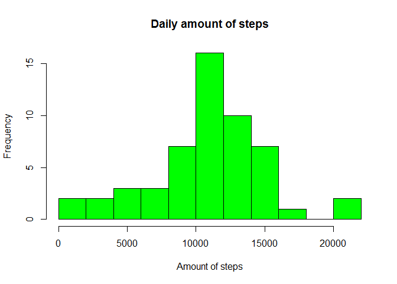
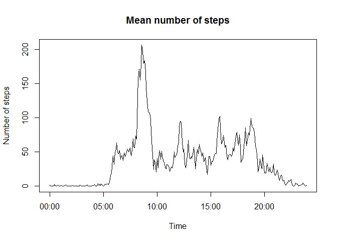
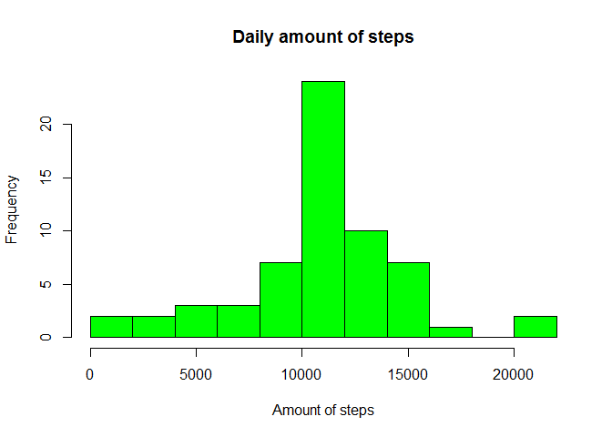

# Reproducible Research: Peer Assessment 1


# Data analysis script

## Download the raw data if not exist yet

```r
mFileName <- "repdata-data-activity.zip"
if(!file.exists(mFileName))
{
        mFileURL <- "https://d396qusza40orc.cloudfront.net/repdata%2Fdata%2Factivity.zip"
        download.file(mFileURL, destfile = mFileName)
}
```
## Unpack the data if not exist yet

```r
if(!file.exists("activity.csv"))
{
        unzip(mFileName, exdir = ".")
}
```
## Loading and preprocessing the data
### Read the data

```r
mData <- read.csv("activity.csv", header = TRUE, stringsAsFactors = FALSE)
```
# Using of "time interval" is nasty: Lets use normal time!
### Convert date and time interval into posix date/time

```r
mData$datetime <- as.POSIXlt(paste(mData$date, sprintf("%04d",mData$interval)), format="%Y-%m-%d %H%M")
```
### Get only meaningful columns

```r
mCleanData = mData[, c("steps","datetime")]
```
## What is mean total number of steps taken per day?
### Get daily sum of steps, create a histogramm

```r
mSumDaily <- tapply(mCleanData$steps, format(mCleanData$datetime, '%Y-%m-%d'), sum)
hist(mSumDaily, breaks = 10, xlab = "Amount of steps", main = "Daily amount of steps", col = "green")
```


### What is a mean and median number of steps per day?

```
## [1] "Daily steps, median = 10765.000000"
```

```
## [1] "Daily steps, mean = 10766.188679"
```
## What is the average daily activity pattern?
### Get mean values for each time interval allover days

```r
mMeanInterval <- aggregate(mCleanData$steps ~ format(mCleanData$datetime, '%H:%M'), FUN = mean, na.rm = TRUE)
plot(as.POSIXlt(mMeanInterval$`format(mCleanData$datetime, "%H:%M")`, format = "%H:%M"), mMeanInterval$`mCleanData$steps`,
     xlab = "Time", ylab = "Number of steps", main = "Mean number of steps", type = "l")
```


### Get maximum steps and corresponding time stamp

```r
mMaxStepsTime <- mMeanInterval$`format(mCleanData$datetime, "%H:%M")`[which.max(mMeanInterval$`mCleanData$steps`)]
mMaxSteps <- mMeanInterval$`mCleanData$steps`[which.max(mMeanInterval$`mCleanData$steps`)]
print(sprintf("Maximum mean steps = %.3f at %s", mMaxSteps, mMaxStepsTime))
```

```
## [1] "Maximum mean steps = 206.170 at 08:35"
```
## Imputing missing values
### Calculate a total number of NA values for steps

```r
mSumNA <- sum(is.na(mData$steps))
print(sprintf("Total number of missing values for steps = %d", mSumNA))
```

```
## [1] "Total number of missing values for steps = 2304"
```
### Set mean value of the time interval if original value is NA
##### At first, find the indicies corresponding to the time interval mean values

```r
mMatchMap <- match(format(mData$datetime, format = "%H:%M"), mMeanInterval$`format(mCleanData$datetime, "%H:%M")`)
```
##### Then replace NA with mean over the time interval

```r
mData$stepsNoNA <- mData$steps
for(i in 1:length(mData$steps))
        if (is.na(mData$steps[i]))
                mData$stepsNoNA[i] <- mMeanInterval$`mCleanData$steps`[mMatchMap[i]]
```

### Get daily sum of steps, create a histogramm

```r
mSumDailyNoNA <- tapply(mData$stepsNoNA, format(mData$datetime, '%Y-%m-%d'), sum)
hist(mSumDailyNoNA, breaks = 10, xlab = "Amount of steps", main = "Daily amount of steps", col = "green")
```


### What is a mean and median number of steps per day?

```
## [1] "Daily steps, median = 10766.188679"
```

```
## [1] "Daily steps, mean = 10766.188679"
```
### Obviously imputting the NA data using the mean values narrows the distribution and mean value gets closer to the median

## Are there differences in activity patterns between weekdays and weekends?
### Create a factor "weekend" "weekday"

```r
mData$mWeekend <- factor(grepl("S(at|un)",weekdays(mData$datetime)), labels = c("weekday", "weekend"))
```
### Get average number of steps for each interval and day type and plot it
##### Note: here I back to nasty interval instead of normal time to be comparable with example plot

```r
mMeanIntervalWeekday <- aggregate(mData$stepsNoNA ~ mData$interval+mData$mWeekend, FUN = mean)
library(lattice)
print(xyplot(`mData$stepsNoNA` ~ `mData$interval` | `mData$mWeekend`,
            data = mMeanIntervalWeekday,
            layout= c(1,2),
            type="l",
            xlab = "Interval",
            ylab = "Number of steps"))
```


### As expected there is a difference between patterns especially in the morning
finished
